## Итоговый проект
1. Создания сервисного аккаунта, бакета, gitlab и gitlab runner.
https://github.com/cranberry511/final_project/tree/main/init

2. Развертывание k8s кластера с помощью Yandex Managed Service for Kubernetes, создание Yandex Container Registry и пайплайн для terraform:   
https://github.com/cranberry511/final_project/tree/main/main

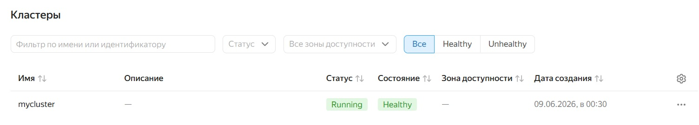

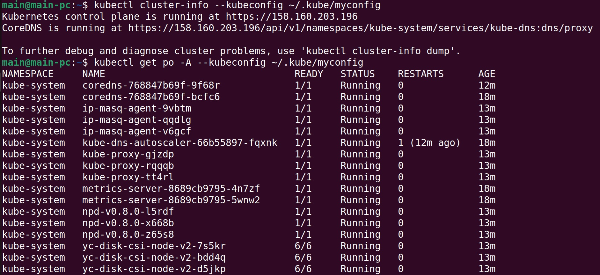

Создание секрета для доступа к Container Registry:
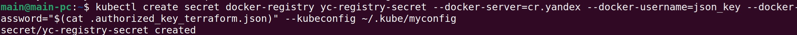

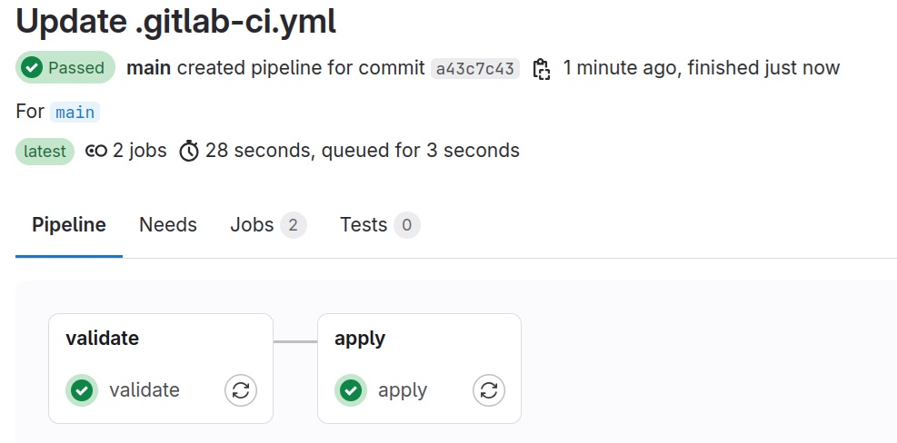

Журнал apply job:   
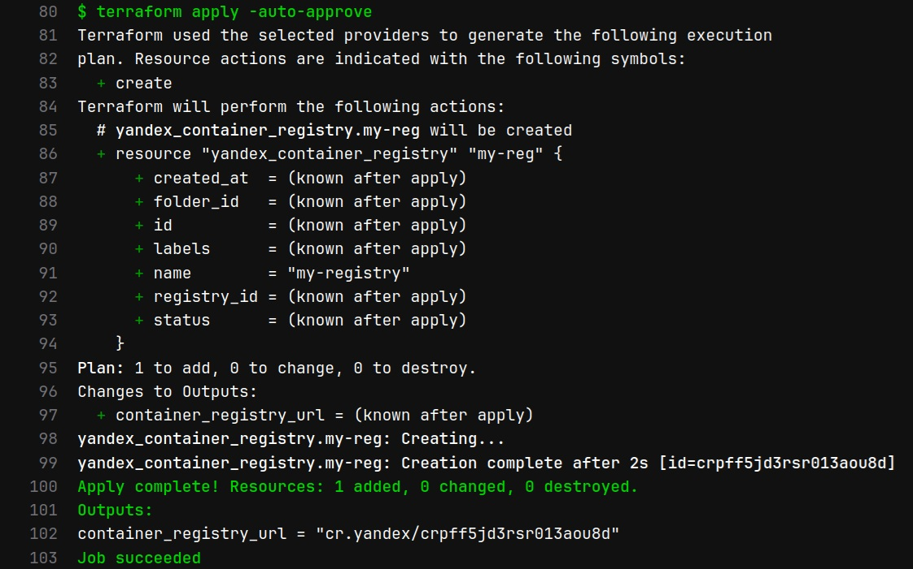

3. Развертывание kube-prometheus-stack через helm.
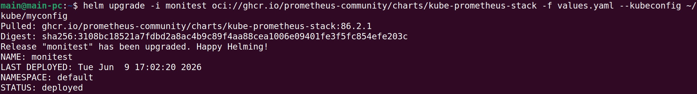

values.yaml:   
https://github.com/cranberry511/final_project/blob/main/helm/values.yaml

4. Создание тестового приложения и пайплайн для автоматической сборки:
https://github.com/cranberry511/final_project/tree/main/app

Сборка без тэга:   
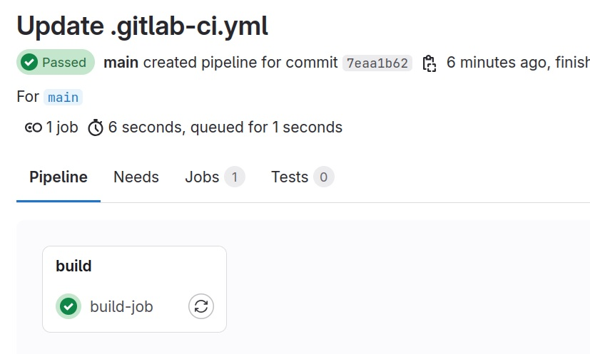

Сборка с тэгом:   
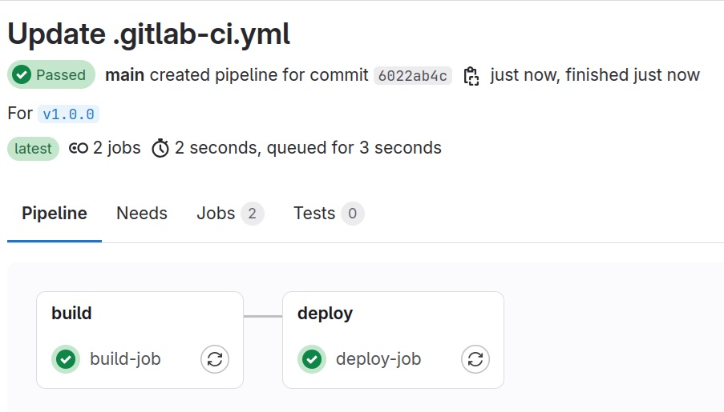

Журнал сборки:   
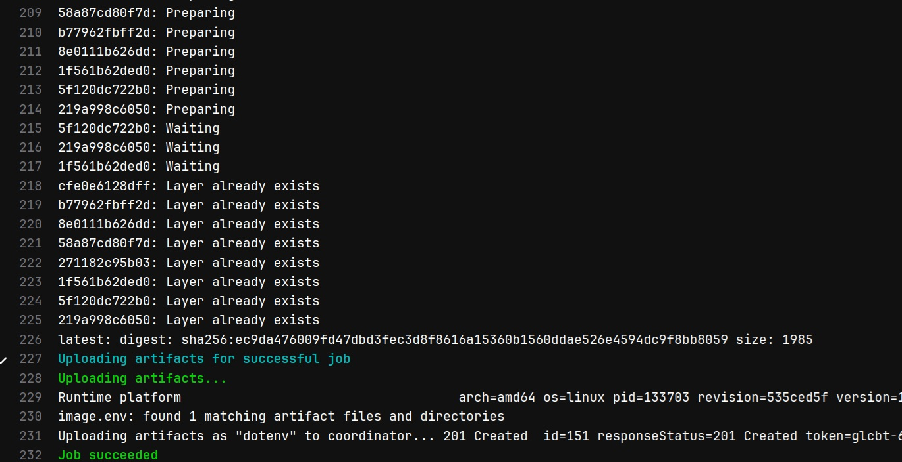

Журнал разветывания:   
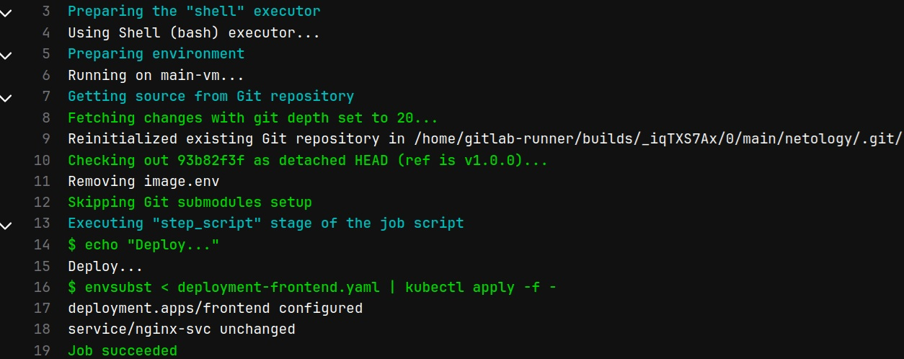

5. Доступ по 80 порту к тестовому приложению и grafana.

Балансировщики, созданные ранее через terraform:   
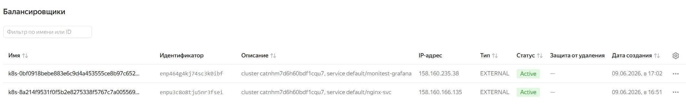

Доступ к приложению:   

Доступ к grafana:   
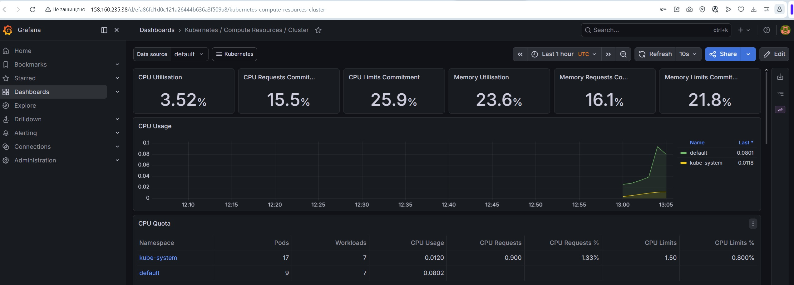
